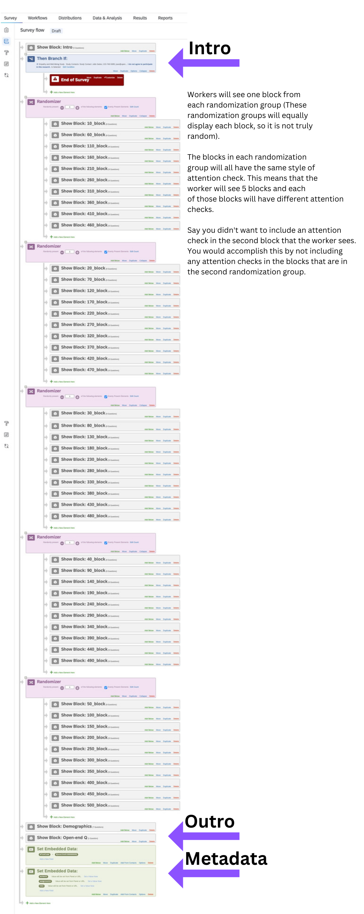

# **Qualtrics Survey Creator**

### **Mixin Classes**
1. CreateBlockMixin
2. TextQuestionMixin
3. ECArticleQuestionMixin
4. ECTurnLVLConvoQuestionMixin
5. MatrixQuestionMixin
6. AttentionCheckQuestionMixin
7. PageTimerQuestionMixin
8. PageBreakQuestionMixin
9. MultipleChoiceQuestionMixin
10. ApplyFlowMixin

And maybe a few more to come in the future!

### Mixin Parent Classes
1. BaseMultipleChoiceQuestion
2. BaseTextQuestion

### **How do you use it?**

There are two examples in the repository. Contact me [here](https://jacobpadilla.com/contact) if you have any questions!

There is also a lot of documentation in ```survey_creator/__init__.py```

The general structure of survey that this creator makes is as follows:




### Installation & Instructions

Download the code:
```bash
git clone https://github.com/jpjacobpadilla/Qualtrics-Survey-Creator.git
```

Navigate to the Repository Directory:
```
cd Qualtrics-Survey-Creator
```

Make some sort of environment:
```bash
python -m venv venv
source venv/bin/activate
```

Install the package in editable mode so that you can make changes to it:
```bash
pip install -e .
```

### Missing files

```secret.py``` - Program secrets. keeps the Qualtrics API key and database credentials.
